<p align="center">
  
</p>
<h1 align="center">RouteRight AI</h1>
<p align="center"><strong>Intelligent Multi-Stop Errand & Route Planning Assistant</strong></p>
<p align="center">
  <a href="https://github.com/HimanshuMohanty-Git24/RouteRight-AI"></a>
  
  
  
  
  
  
</p>
<p align="center">Made by <a href="https://x.com/CodingHima" target="_blank">Himanshu Mohanty</a></p>

---

## Table of Contents
- [Screenshots](#screenshots)
- [Demo Video](#demo-video)
- [Vision](#vision)
- [Why RouteRight AI](#why-routeright-ai)
- [Key Features](#key-features)
- [How It Works (Agentic Flow)](#how-it-works-agentic-flow)
- [Architecture](#architecture)
- [Tech Stack](#tech-stack)
- [Folder Structure](#folder-structure)
- [Backend Setup](#backend-setup)
- [Frontend Setup](#frontend-setup)
- [Environment Variables](#environment-variables)
- [Running the Full Stack](#running-the-full-stack)
- [Usage Examples](#usage-examples)
- [License](#license)
- [Acknowledgments](#acknowledgments)

---

## Screenshots


## Demo Video

https://github.com/user-attachments/assets/e137bace-ed22-4fff-acea-8690801ecc69

---

## Vision
RouteRight AI aims to solve the everyday problem of multi‑stop errand planning. Instead of juggling addresses, searching for places, and mentally optimizing the order of tasks (post office → groceries → coffee shop → pharmacy, etc.), users express intent once in natural language. The system decomposes the request, finds suitable venues, validates feasibility, and outputs an optimized, sequential, actionable plan—with map-friendly routing.

## Why RouteRight AI
Modern map & navigation tools are great at point A → B. Real life is A → B → C → D with constraints. RouteRight AI focuses on:
- Reducing cognitive load of planning multiple errands.
- Automating venue discovery (e.g., “closest well‑rated coffee shop near my grocery stop”).
- Sequencing stops for minimal travel time & coherent flow.
- Producing a clean, human-readable plan users can execute immediately.
- Providing an extensible agent graph for future context (time windows, budgets, preferences).

## Key Features
- Natural language multi‑task intent parsing.
- Task decomposition into structured actionable steps.
- Smart place search via Foursquare & supplemental APIs (e.g., SERP / local search).
- Validation & enrichment of candidate locations.
- Route optimization for ordering stops.
- Agentic orchestration (specialized agents: decomposer, place search, validator, routing, formatting).
- FastAPI backend with typed request/response models.
- React + Vite frontend with interactive plan list & map preview component.
- Modular service layer (caching, external API abstraction) enabling easy replacement.
- Extensible graph workflow module for future addition of constraints.

## How It Works (Agentic Flow)


1. Intent Ingestion: User input like “Tomorrow morning: mail package, buy fresh vegetables, then grab a cappuccino near the park.”
2. Task Decomposition Agent: Splits into atomic errands with inferred attributes.
3. Place Search Agent: Queries Foursquare (and optionally SERP) for candidate venues matching each task.
4. Validation Agent: Filters by rating, distance, category, or other constraints.
5. Routing Agent: Computes optimized path ordering (e.g., via distance matrix or routing service heuristics).
6. Formatter Agent: Produces final ordered plan with addresses, names, categories & suggested sequence.
7. Frontend Renders: List view + (future) map visualization & progress carousel.

## Architecture

```mermaid
graph TB
    subgraph "User Interface Layer"
        User[👤 User] 
        User --> |"Natural Language Query<br/>e.g. 'Find romantic restaurants near Central Park'"| FE[⚛️ React Frontend]
        FE --> |"Gets GPS coordinates"| BrowserAPI[📍 Browser Geolocation API]
        BrowserAPI --> |"lat: 40.7829, lng: -73.9654"| FE
        FE --> |"State: query, location, loading, results"| Zustand[🏪 Zustand Store]
        FE --> |"HTTP POST /api/v1/plan"| APIClient[📡 Axios Client]
    end

    subgraph "API Gateway & Request Processing"
        APIClient --> |"Payload: {query, lat, lng, preferences}"| FastAPI[🖥️ FastAPI Server]
        FastAPI --> |"Request validation & routing"| Middleware[🔒 Auth & Rate Limiting]
        Middleware --> |"Validated request object"| LangGraph[🎯 LangGraph Orchestrator]
    end

    subgraph "Agentic Workflow Pipeline"
        LangGraph --> |"Raw query analysis"| Decomposer[🧠 Query Decomposer Agent]
        
        Decomposer --> |"Structured task array:<br/>• category: 'restaurant'<br/>• cuisine: 'romantic'<br/>• location: 'Central Park'<br/>• radius: 2km"| Searcher[🔍 Place Search Agent]
        
        Searcher --> |"Candidate places array:<br/>• [{name, address, rating, price}]<br/>• Raw API responses<br/>• Duplicate entries"| Validator[✅ Validation Agent]
        
        Validator --> |"Filtered places array:<br/>• Deduplicated locations<br/>• Verified open hours<br/>• Quality score > 4.0"| Optimizer[🗺️ Route Optimization Agent]
        
        Optimizer --> |"Optimized route object:<br/>• waypoints: [lat,lng pairs]<br/>• estimated_time: 180min<br/>• total_distance: 5.2km<br/>• route_order: [0,2,1,3]"| Formatter[📋 Response Formatter]
        
        Formatter --> |"Final structured response"| LangGraph
    end

    subgraph "Core Services & Data Layer"
        ServiceLayer[⚙️ Service Layer Manager]
        
        subgraph "Cache Layer"
            Redis[💾 Redis Cache]
            CacheKeys["🔑 Cache Keys:<br/>• query_hash:results<br/>• place_id:details<br/>• route_cache:optimized_path"]
        end
        
        subgraph "Optimization Engine"
            ORTools[🧮 Google OR-Tools]
            TSPSolver["📐 TSP Solver:<br/>• Distance matrix<br/>• Time constraints<br/>• Vehicle routing"]
        end
    end

    subgraph "External API Integrations"
        subgraph "LLM Services"
            Groq[🤖 Groq LLM API]
            GroqModels["📚 Models:<br/>• llama-3.1-70b reasoning<br/>• mixtral-8x7b fast responses"]
        end
        
        subgraph "Places Data"
            Foursquare[🏢 Foursquare Places API]
            FoursquareData["📊 Returns:<br/>• venue details<br/>• photos, reviews<br/>• categories, hours"]
            
            SerpAPI[🔍 SerpAPI Google Places]
            SerpData["📊 Returns:<br/>• search results<br/>• business info<br/>• real-time data"]
        end
    end

    %% Service connections
    Decomposer -.-> ServiceLayer
    Searcher -.-> ServiceLayer
    Validator -.-> ServiceLayer
    Optimizer -.-> ServiceLayer
    
    ServiceLayer --> |"Cache lookup/store"| Redis
    ServiceLayer --> |"Route optimization requests"| ORTools
    
    ServiceLayer --> |"Query analysis requests"| Groq
    ServiceLayer --> |"Place search requests"| Foursquare
    ServiceLayer --> |"Backup search requests"| SerpAPI

    %% Response flow
    LangGraph --> |"Formatted response JSON"| FastAPI
    FastAPI --> |"HTTP 200 + structured plan"| APIClient
    APIClient --> |"Update UI state"| Zustand
    Zustand --> |"Render results"| FE
    FE --> |"Display interactive map + itinerary"| User

    %% Styling
    classDef userLayer fill:#e3f2fd,stroke:#1976d2
    classDef apiLayer fill:#f3e5f5,stroke:#7b1fa2
    classDef agentLayer fill:#fff3e0,stroke:#f57c00
    classDef serviceLayer fill:#e8f5e8,stroke:#388e3c
    classDef externalLayer fill:#fce4ec,stroke:#c2185b

    class User,FE,BrowserAPI,Zustand,APIClient userLayer
    class FastAPI,Middleware,LangGraph apiLayer
    class Decomposer,Searcher,Validator,Optimizer,Formatter agentLayer
    class ServiceLayer,Redis,CacheKeys,ORTools,TSPSolver serviceLayer
    class Groq,GroqModels,Foursquare,FoursquareData,SerpAPI,SerpData externalLayer
```



## Tech Stack
Backend:
- FastAPI (Python 3.12)
- LangChain + LangGraph (agent graph orchestration)
- Groq LLM API (via langchain-groq) for fast, cost‑efficient inference
- External APIs: Foursquare, SERP API (if configured), routing services
- OR-Tools (optimization heuristics / potential future advanced routing)
- Caching layer (custom simple cache module)

Frontend:
- React + Vite
- Component architecture (PlanListCard, RouteStepperCard, MapPreview, etc.)
- Global state with Zustand (planStore)
- Context-based theming (ThemeContext)

Tooling & Infra:
- uv / pip for Python dependency management
- Node + npm (or pnpm) for frontend
- Typed Pydantic models for clean request/response contracts

## Folder Structure
```
└── routeright-ai
    ├── backend
    │   ├── app
    │   │   ├── agents
    │   │   │   ├── formatter.py
    │   │   │   ├── orchestrator.py
    │   │   │   ├── place_search.py
    │   │   │   ├── routing.py
    │   │   │   ├── task_decomposer.py
    │   │   │   └── validator.py
    │   │   ├── graph
    │   │   │   └── workflow.py
    │   │   ├── models
    │   │   │   ├── graph_state.py
    │   │   │   ├── request_models.py
    │   │   │   └── response_models.py
    │   │   ├── services
    │   │   │   ├── cache.py
    │   │   │   ├── foursquare.py
    │   │   │   ├── routing_service.py
    │   │   │   └── serpapi_service.py
    │   │   ├── utils
    │   │   │   └── config.py
    │   │   └── main.py
    │   ├── pyproject.toml / requirements.txt / uv.lock
    └── frontend
        ├── public (favicon, etc.)
        └── src
            ├── assets (logo.png)
            ├── components
            ├── contexts
            ├── services (api.js)
            ├── stores (planStore.js)
            ├── utils (constants.js)
            ├── App.jsx / main.jsx / theme.js
```

## Backend Setup
Prerequisites:
- Python 3.11 (see .python-version)
- (Optional) uv for fast dependency installation: https://github.com/astral-sh/uv

Install (Option A: uv):
```
cd backend
uv sync
```
Install (Option B: pip):
```
cd backend
python -m venv .venv
source .venv/bin/activate  # Windows: .venv\Scripts\activate
pip install -r requirements.txt
```

Run the API (default FastAPI dev server):
```
cd backend/app
uvicorn main:app --reload --port 8000
```

## Frontend Setup
Prerequisites:
- Node.js 20+
- npm (or pnpm / yarn)

Install & Run:
```
cd frontend
npm install
npm run dev
```
The app will start (default Vite) at: http://localhost:5173 (shown in console).
Ensure the backend is accessible; configure base URL via environment variable (see below).

## Environment Variables

Backend (.env or backend/.env):
Refer to backend/.env.example. Copy and adjust:
```env
GROQ_API_KEY="YOUR_GROQ_API_KEY"
FOURSQUARE_API_KEY="YOUR_FOURSQUARE_API_KEY"
SERPAPI_API_KEY="YOUR_SERPAPI_API_KEY"  # optional
GROQ_MODEL="llama-3.3-70b-versatile"
ROUTING_PROVIDER="ors"
CACHE_TTL_SECONDS=600
LOG_LEVEL="info"
CORS_ORIGINS='["http://localhost:5173"]'
REDIS_HOST="your_redis_host"
REDIS_PORT=17220
REDIS_USERNAME="default"
REDIS_PASSWORD="your_redis_password"
```

Frontend (frontend/.env):
```env
VITE_API_BASE_URL=http://localhost:8000
```
Never commit actual secrets. Add *.env to .gitignore if not already present.

## Running the Full Stack
Option A (two terminals):
1. Terminal 1: Run backend `uvicorn main:app --reload --port 8000`.
2. Terminal 2: Run frontend `npm run dev`.

Option B (bash script):
1. Make executable: `chmod +x run_dev.sh`
2. Run: `./run_dev.sh`
   - Exports BACKEND_PORT / FRONTEND_PORT optionally.

Option C (root concurrent scripts):
1. From repository root run: `npm install` (installs dev dependency concurrently).
2. Run both with: `npm run dev`.
3. Alternate script: `npm run dev:uv`.

## Usage Examples
Natural Language Request (Frontend):
Type: "Plan my afternoon: drop a parcel at the post office, buy organic vegetables, and find a cozy coffee shop near the market."
Backend Flow: Decompose → Search Foursquare → Validate → Optimize route → Return ordered plan JSON.
Example cURL (placeholder endpoint):
```
curl -X POST http://localhost:8000/plan \
  -H "Content-Type: application/json" \
  -d '{"request": "Mail a package, buy groceries, then grab a latte"}'
```
(Adjust path/JSON keys to match actual request_models.py.)
Response (illustrative):
```
{
  "steps": [
    {"order": 1, "task": "Mail package", "place": {"name": "USPS Station", "address": "..."}},
    {"order": 2, "task": "Buy groceries", "place": {"name": "Fresh Market", "address": "..."}},
    {"order": 3, "task": "Find coffee", "place": {"name": "Blue Bean Cafe", "address": "..."}}
  ],
  "total_distance_km": 7.4,
  "est_duration_min": 42
}
```

## License
This project is released under the MIT License.

## Acknowledgments
- Foursquare Places API for rich place data.
- LangChain for open-source agent tooling abstractions.
- FastAPI & React communities for modern developer ergonomics.
- Groq for high-performance LLM inference via langchain-groq.

---
<p align="center">© 2025 RouteRight AI — Built with care by <a href="https://x.com/CodingHima">Himanshu Mohanty</a>.</p>
<p align="center"><sub>All product names, logos, and brands are property of the owners. This project is for educational & productivity enhancement purposes.</sub></p>


